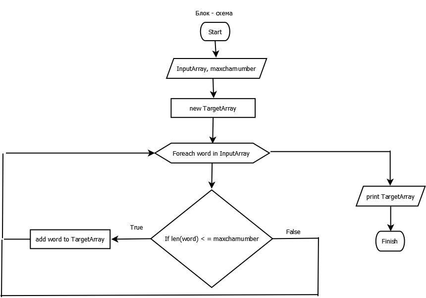
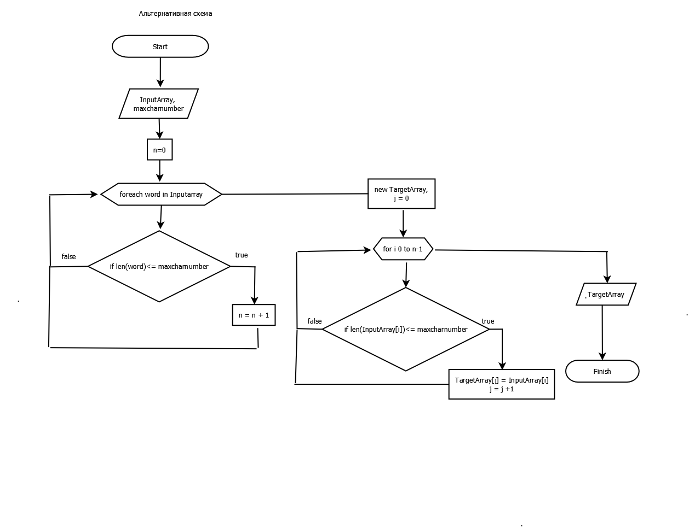

# Итоговая контрольная работа по основному блоку #

Задание: Написать программу, которая из имеющегося массива строк (InputArray) формирует новый массив из строк (TargetArray), длина которых меньше, либо равна 3 символам (maxcharnumber). Первоначальный массив можно ввести с клавиатуры, либо задать на старте выполнения алгоритма. При решении не рекомендуется пользоваться коллекциями, лучше обойтись исключительно массивами.

Предлагаемая блок - схема:

## Описание работы ##

1. Массив SymbolsArray

Содержит кирилические и латинские символы, цифры и знаки пунктуации, а также часть спецсимволов.

2. Функции RandomString.

Генерирует случайную строку до 10 символов из SymbolsArray.

3. Функция RandomArray.

Генерирует массив из случайных строк.

4. Функция CuttedArray.

Изображена на блок - схеме.

5. Метод Main

предназначен для взаимодействия.

## Примечание ##

Функция CuttedArray реализована через метод append, который каждый раз создаёт новый массив TargetArray. На больших массивах это приведёт к замедлению работы.
Альтернативный способ изображён ниже

Блок - схема воплощена в модуле alter.cs
