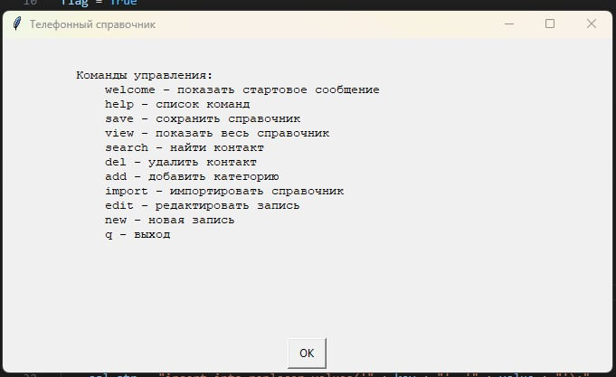

# Знакомство с языком Python (семинары) #

## Урок 8. Работа с файлами ##

*Задание:*

*на Отлично в одного человека надо сделать консольное приложение Телефонный справочник с внешним хранилищем информации, и чтоб был реализован основной функционал - просмотр, сохранение, импорт, поиск, удаление, изменение данных.*

### Хранилище информации ###

Хранилище основано на базе БД SQLite3. Схема приведена ниже.

### Запуск приложения ###

При запуске программа создаёт базу данных, если её нет.
Создаются таблицы показанные на схеме, а также таблица *replacer*, которая является словарём для перевода полей таблиц в удобочитаемый вид.

Далее загружается окошко со списком команд.

### Команды ###

**welcome** - показывает стартовое окошко

**help** - показывает список команд в консоли

**view** - отображает все записи в справочнике

**save** - позволяет моздать резервную копию справочника

**import** - импортирует все таблицы в csv формате

**search** - ищет запись по части имени

**del** - удаляет запись

**add** - добавляет поле в справочник

**edit** - редактирует запись в справочнике

**new** - добавляет новую запись

**q** - выход из программы

### Пояснения ###

Это первая попытка использования SQLite3 и графического интерфейса в Python. Код перегружен и плохо читаем. К сожалению, моего опыта пока не достаточно, чтобы правильно привязать элементы управления к полям БД. Также возникли проблемы при переводе данных из БД в программу, что также увеличило код. Но за ограниченное время, думаю, успехом являтся что программа вообще работает.

