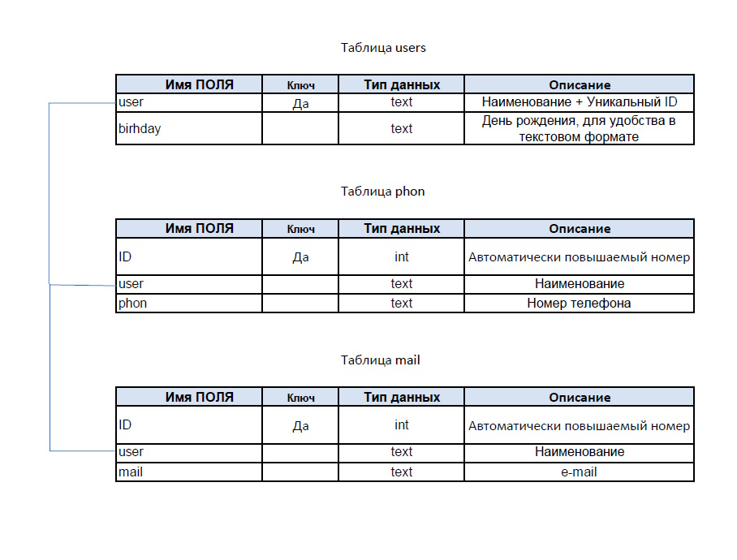

# Знакомство с языком Python (семинары) #

## Урок 8. Работа с файлами ##

*Задание:*

*Cделать приложение Телефонный справочник с внешним хранилищем информации*

### Хранилище информации ###

Хранилище основано на базе БД SQLite3. Схема приведена ниже.

Поле *title* предначено для наменования контакта - чаще всего применяют ФИО. Поиск осуществляется по этому полю, также оно является ключевым.

Поле *phones* - хранит список телефонов с разделителем ';'.

Поле *mails* - список адресов e-mail.

Поле *birthday* для даты рождения в свободном формате, поэтому тип text.

Поле *addons* - список дополнений, желательно, но не обязательно, в виде **ключ : значение**.

### Интерфейс ###

Приложение является оконным на основе **tkinter**. Родные диалоговые окна tkinter, на мой взгляд, не слишком удобные, поэтому применяется интефейс **easygui**. На форме размещены элементы управления:

1. Entry для отображения и изменения:

    **ent_title** - наменования контакта

    **ent_bday** - день рождения

    **ent_search** - для поска контакта

2. Labels

    **lbl_path** - отображает путь к открытому файлу

    **lbl_title** - просто надпись **Имя** для наменования контакта

    **lbl_phon** - просто надпись **Телефоны** для списка телефонов

    **lbl_mail** - просто надпись **e-mail** для списка e-mail

    **lbl_day** - просто надпись **День рождения** 

    **lbl_addon** - просто надпись **Дополнительная информация** для списка дополнений

    **lbl_index** - отображает номер записи в отсортированном списке записей

3. Listboxes

    ***box_phone*** - отображает список телефонов

    ***box_phone*** - отображает список почтовых адресов

    ***box_phone*** - отображает список дополнений

4. Buttons

    ***btn_phone*** и ***btn_e_phone*** - для добавления телефона в список и изменения списка, соответственно. Процедуры обработчики - ***New_phone*** и ***Edit_phone***.

    ***btn_mail*** и ***btn_e_mail*** - аналогично для списка e-mail. Процедуры обработчики - ***New_email*** и ***Edit_email***.

    ***btn_addons*** и ***btn_e_addons*** - аналогично для списка дополнений. Процедуры обработчики - ***New_addons*** и ***Edit_addons***

    ***btn_search*** - для поиска контакта по части имени. Процедура обработчик ***Search_rec*** отображает список результатов в *choicebox*.

    ***btn_Save_rec*** - Записывает текущую запись в БД. Процедура обработчик ***Save_rec***.

    ***btn_first***, ***btn_prev***, ***btn_next*** и ***btn_last*** - для перелистывания записей. Процедуры обработчики - ***Movie_first***, ***Movie_prev***, ***Movie_next*** и ***Movie_last***.

5. Menu

    Вкладка ***Файл*** состоит из 2 команд:

    ***Новый*** - создаёт новыую базу данных через процедуру ***New_db***.

    ***Открыть*** - создаёт новыую базу данных через процедуру ***Open_db***

    Вкладка ***Запись*** состоит из 3 команд:

    ***Новая*** - создаёт новыую базу данных через процедуру ***New_rec***

    ***Cохранить*** - создаёт новыую базу данных через процедуру ***Save_rec***

    ***Удалить*** - создаёт новыую базу данных через процедуру ***Del_rec***

### Процедуры, не связанные с элементами управления ###

**Read_db(Data : Connection, recindex)** - основная процедура, которая считывает данные из БД и размещает данные из записи с номером recindex  в соответствующих элементах управления.

**Connect(dbpath)** - подключает БД из фйла по пути к файлу dbpath.

**Edit(list : Listbox)** - редактирует данные указанного Listbox.

### Заключение ###

     

